# Credit & Share Protocol

## 消费即积累，让每一次消费成为长期价值

---

# 目录 / Table of Contents

1. [团队介绍 / Team Introduction](#1-团队介绍--team-introduction)
2. [项目概述 / Project Overview](#2-项目概述--project-overview)
3. [技术亮点 / Technical Highlights](#3-技术亮点--technical-highlights)
4. [当前进展 / Current Progress](#4-当前进展--current-progress)
5. [市场与竞争分析 / Market & Competition Analysis](#5-市场与竞争分析--market--competition-analysis)
6. [商业模式与融资计划 / Business Model & Fundraising Plan](#6-商业模式与融资计划--business-model--fundraising-plan)
7. [未来计划 / Future Roadmap](#7-未来计划--future-roadmap)

---

# 1. 团队介绍 / Team Introduction

## 核心团队

| 角色 | 姓名 | 背景 |
|------|------|------|
| **项目负责人** | 付饶 | 北京大学硕士<br>香港注册数字资产分析师<br>《大公报》"链能讲堂"专栏作家<br>前香港 Web3.0 标准化协会副理事长 |
| **技术负责人** | 王舒 | 加拿大麦克马斯特大学计算机博士<br>前 IBM 前 5% 核心员工<br>火币前 20 大交易员 |

## 团队优势

### 🎓 学术背景
- 北京大学、McMaster 大学等世界知名院校
- 香港中文大学、香港理工大学、华中科技大学等

### 💼 行业经验
- Web3 标准化与合规经验
- 传统金融与加密交易双重背景
- 企业级系统开发能力

### 🌏 地域优势
- 深耕香港与大湾区市场
- 连接内地与全球 Web3 生态

---

# 2. 项目概述 / Project Overview

## 2.1 我们解决什么问题？

### 传统消费积分体系的三大结构性问题

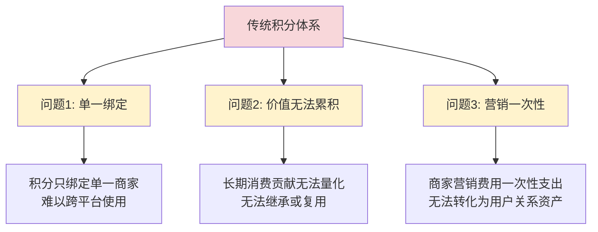

### DeFi 缺乏真实资产支撑

> 去中心化金融虽然具备成熟的收益分配机制，但**缺乏真实、可持续的消费型资产作为底层支撑**。

## 2.2 我们的解决方案

### 核心理念

> **将"长期消费行为"转化为一种可累计、可分配、可退出的资产结构，同时避免投机化。**

### 双资产模型

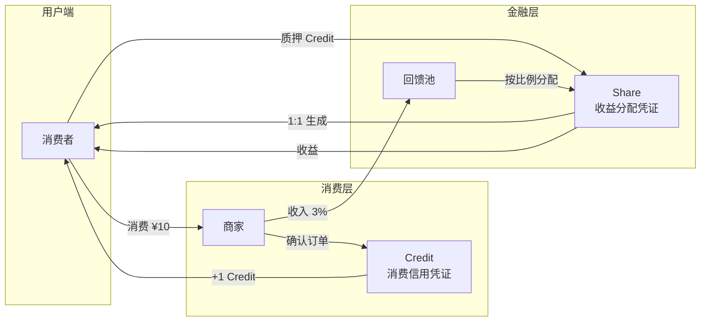

## 2.3 资产分层设计

| 属性 | Credit (积分) | Share (RWA) |
|------|---------------|-------------|
| **本质** | 消费信用凭证 | 收益分配凭证 |
| **来源** | 真实消费 | 商家真实收入 |
| **是否可交易** | ❌ 否 | ✅ 是 |
| **是否可现金退出** | ❌ 否 | ✅ 是 |
| **主要作用** | 权益、资格、权重 | 收益、退出、流动性 |

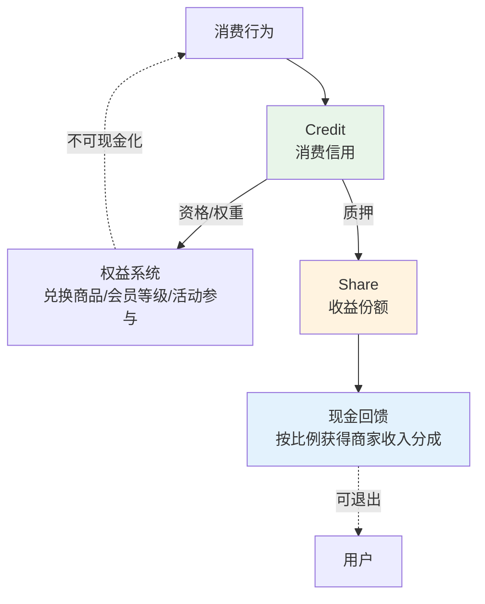

## 2.4 核心设计原则

| 原则 | 说明 |
|------|------|
| 💰 **真实现金流原则** | 所有收益分配仅来源于真实商家收入，而非代币通胀 |
| 🛒 **消费优先原则** | 金融行为永远是消费行为的副产品，而非反向驱动 |
| 📊 **资产分层原则** | 消费权利与收益权利必须严格分离，以避免系统性套利 |
| 🚪 **可退出但不可抽干原则** | 系统允许金融退出，但不允许对消费系统本身造成破坏 |

---

# 3. 技术亮点 / Technical Highlights

## 3.1 系统架构

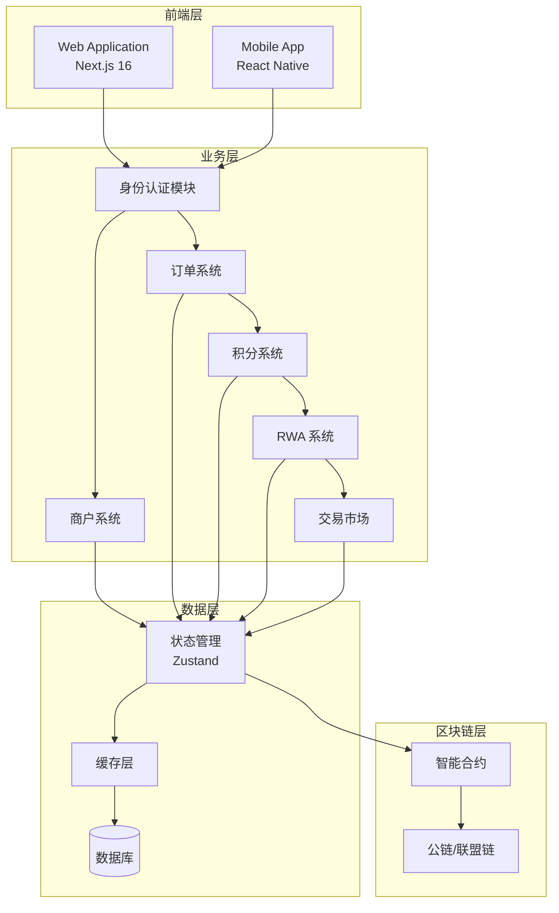

## 3.2 技术栈

| 层级 | 技术选型 | 优势 |
|------|----------|------|
| **框架** | Next.js 16 + React 19 | 最新特性，服务端渲染，优秀性能 |
| **语言** | TypeScript | 类型安全，开发效率高 |
| **样式** | Tailwind CSS v4 | 原子化CSS，开发效率高 |
| **设计** | Material Design 3 | 现代化UI，用户体验好 |
| **状态** | Zustand | 轻量级，易用，性能好 |
| **动画** | Framer Motion | 流畅动画，提升用户体验 |
| **图表** | Recharts | 专业金融图表，K线/深度图 |

## 3.3 核心功能模块

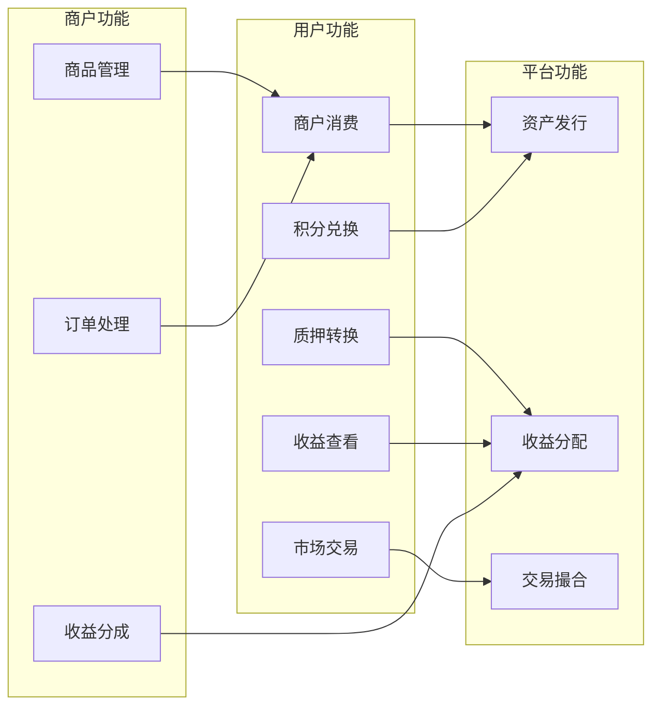

### 交易市场特性

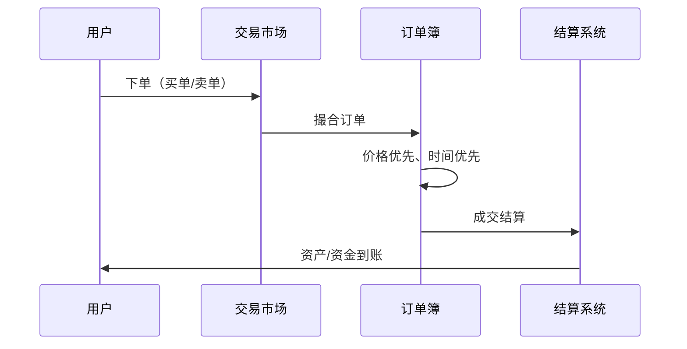

**交易市场功能：**
- ✅ 限价单 / 市价单
- ✅ 订单簿深度展示
- ✅ K线图（日/周/月）
- ✅ 24小时涨跌幅
- ✅ 撤单功能
- ✅ 历史订单查询

## 3.4 收益分配机制

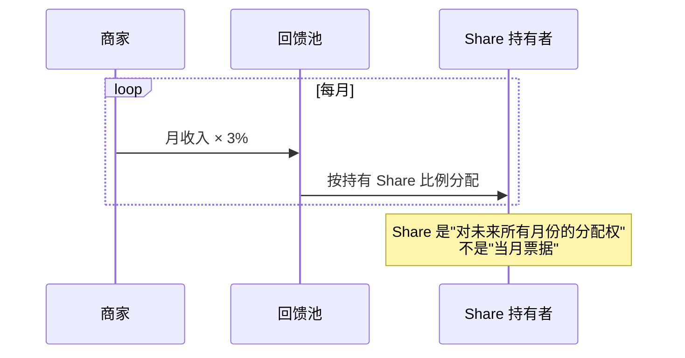

**收益公式：**
```
用户收益 = 回馈池金额 × (用户持有 Share ÷ 总 Share)
```

---

# 4. 当前进展 / Current Progress

## 4.1 产品进度

### ✅ 已完成
- 落地页（平台介绍、核心指标展示）
- 用户仪表盘（资产总览、收益图表）
- 商户系统（浏览、消费、购物车）
- 积分兑换商城（商品展示、兑换流程）
- 质押系统（Credit → Share 转换）
- RWA 交易市场（订单簿、K线、限价/市价单）

### 🚧 进行中
- 区块链集成（智能合约开发）
- 商户后台管理系统

### 📋 规划中
- 移动端 App
- 多商户接入

## 4.2 演示数据

| 指标 | 数值 |
|------|------|
| 总用户数 | 1,234 |
| 总积分发行量 | 45,678 |
| 已分配收益 | $12,345.67 |
| 总 RWA 数量 | 23,456 |

## 4.3 已实现功能清单

### 用户端功能

| 模块 | 功能 | 状态 |
|------|------|------|
| **落地页** | 平台介绍、核心指标、CTA | ✅ |
| **仪表盘** | 资产总览、收益趋势图、活动记录 | ✅ |
| **商户系统** | 商户列表、商品浏览、购物车、结算 | ✅ |
| **积分兑换** | 兑换商品列表、积分兑换、兑换记录 | ✅ |
| **质押系统** | Credit 质押、Share 获得 | ✅ |
| **交易市场** | 订单簿、K线图、下单、撤单、历史 | ✅ |

### 商户端功能

| 模块 | 功能 | 状态 |
|------|------|------|
| **商品管理** | 商品上架、库存管理 | 🚧 |
| **订单处理** | 订单确认、发货 | 🚧 |
| **收益查看** | 收入统计、分成明细 | 🚧 |

---

# 5. 市场与竞争分析 / Market & Competition Analysis

## 5.1 市场规模

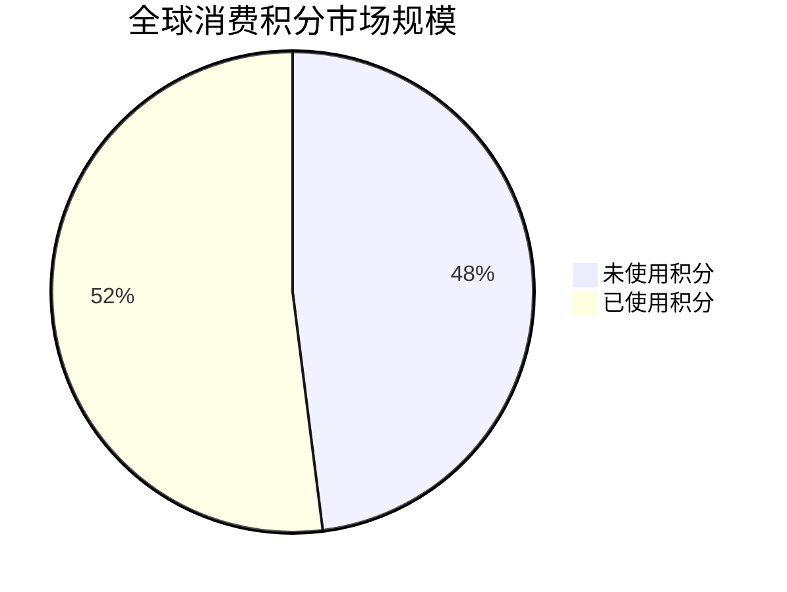

**市场数据：**
- 全球消费积分市场：**$200B+**
- 未兑换积分价值：**$100B+**
- 年增长率：**15%+**

## 5.2 竞争格局

| 竞品类型 | 代表项目 | 特点 | 我们的优势 |
|----------|----------|------|------------|
| **传统积分平台** | 航空里程、信用卡积分 | 封闭生态，无法跨平台 | 开放生态，可跨商户 |
| **积分交易平台** | Points.com | 只能兑换，无法获得收益 | Share 可获得持续收益 |
| **RWA 项目** | Ondo Finance, Centrifuge | 机构资产，门槛高 | 消费场景，门槛低 |
| **DeFi 收益平台** | Compound, Aave | 需抵押，收益不稳定 | 真实现金流支撑 |

## 5.3 竞争优势

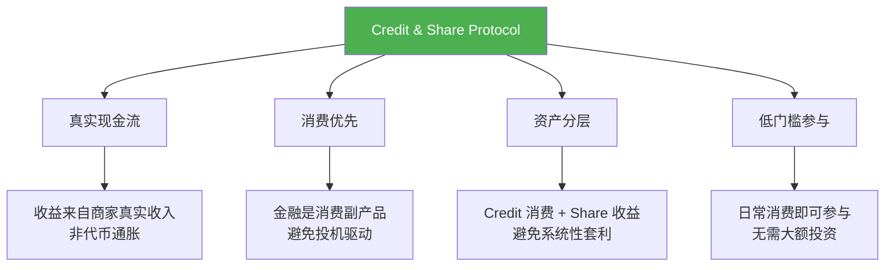

## 5.4 目标用户

| 用户类型 | 痛点 | 需求 | 获客渠道 |
|----------|------|------|----------|
| 🧑‍💼 **消费者** | 积分价值低、难以累积、无法变现 | 消费获得长期收益、积分跨平台使用 | 合作商户导流、社交媒体推广 |
| 🏪 **商户** | 营销费用一次性、用户复购率低 | 将营销支出转化为用户关系资产 | 行业展会、地推团队 |
| 💰 **投资者** | RWA 项目门槛高、流动性差 | 低门槛参与真实资产收益 | Web3 社区、加密交易所 |

---

# 6. 商业模式与融资计划 / Business Model & Fundraising Plan

## 6.1 商业模式

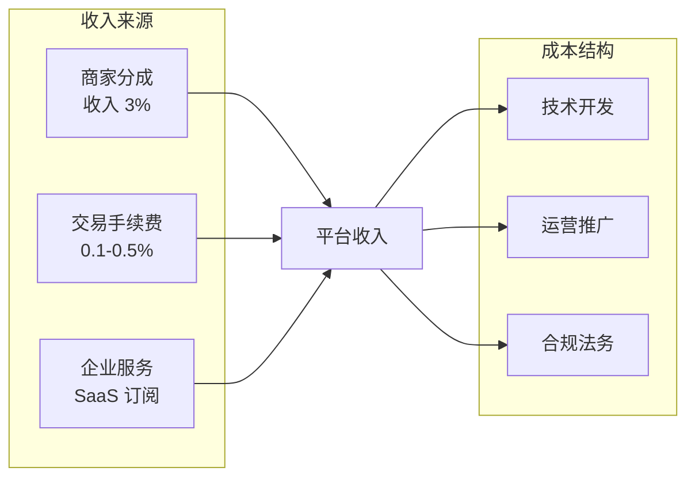

## 6.2 收入模型

| 收入来源 | 描述 | 预期占比 |
|----------|------|----------|
| **商家分成** | 商家收入的 3% 中，平台抽取部分 | 60% |
| **交易手续费** | Share 二级市场交易手续费 | 30% |
| **企业服务** | 商户 SaaS 订阅费 | 10% |

## 6.3 融资计划

| 轮次 | 金额 | 用途 | 里程碑 |
|------|------|------|--------|
| 🌱 **种子轮**（当前） | $500K - $1M | 产品完善、区块链集成、首批商户接入 | 10+ 商户、5,000+ 用户 |
| 🌿 **A轮**（6-12个月后） | $2M - $5M | 市场扩展、团队扩张、合规牌照 | 100+ 商户、50,000+ 用户 |
| 🌳 **B轮**（18-24个月后） | $10M+ | 区域扩张、生态建设、IPO 准备 | 500+ 商户、200,000+ 用户 |

## 6.4 资金用途

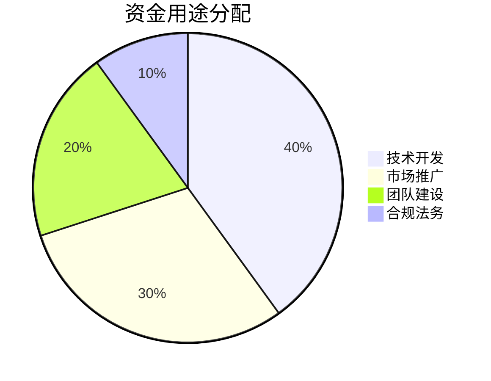

---

# 7. 未来计划 / Future Roadmap

## 7.1 发展路线图

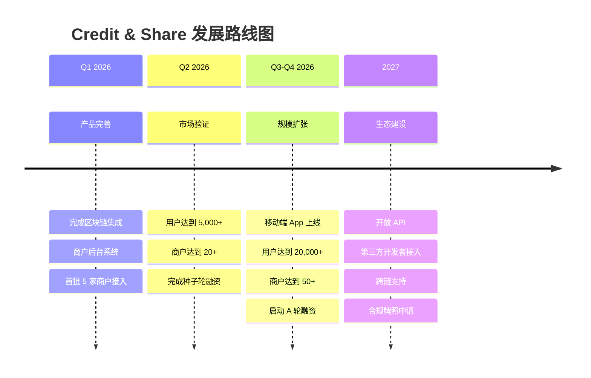

## 7.2 里程碑目标

| 时间节点 | 用户数 | 商户数 | 交易量 | 融资 |
|----------|--------|--------|--------|------|
| Q1 2026 | 1,000 | 5 | $100K | - |
| Q2 2026 | 5,000 | 20 | $500K | 种子轮 |
| Q4 2026 | 20,000 | 50 | $2M | A轮准备 |
| Q4 2027 | 100,000 | 200 | $10M | A轮完成 |

## 7.3 长期愿景

> **🎯 使命：让每一次消费都成为长期价值的积累**

> **🌐 愿景：成为全球领先的消费型 RWA 基础设施**

### 📊 2028 年目标

| 指标 | 目标 |
|------|------|
| 用户数 | 1,000,000+ |
| 合作商户 | 1,000+ |
| 年交易量 | $100M+ |
| 市场覆盖 | 亚太主要市场 |

---

# 联系我们 / Contact

---

**让消费创造长期价值**

*Credit & Share Protocol*

🌐 Website: [https://coffee.rwa.ltd]

---

*本演示文稿仅供信息展示，不构成任何投资建议或承诺。*
