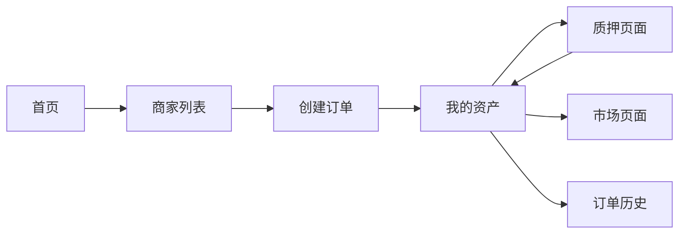

# Consumer Demo - 产品需求文档

## 文档信息

- **版本**: v0.1 (Hackathon Demo)
- **目标**: 黑客松展示用消费者体验 Demo
- **技术栈**: Next.js 14 + Tailwind CSS + Mock Data
- **开发周期**: 3-5 天

------

## 1. Demo 目标

### 1.1 核心目标

通过一个完整的消费者旅程，展示 Credit & Share 双资产模型的核心价值：

> **"消费即积累，长期获得收益"**

### 1.2 演示场景

**故事线**: 一个用户从第一次消费到获得收益的完整体验

1. 用户在咖啡店消费 → 获得 Credit
2. 用户质押 Credit → 获得 Share
3. 商家产生收入 → 用户获得收益分配
4. 用户可以在市场交易 Share

### 1.3 Demo 特点

- ✅ 纯前端实现，使用 Mock 数据
- ✅ 流畅的动画和交互
- ✅ 清晰的数据可视化
- ✅ 完整的用户旅程
- ✅ 适合 3-5 分钟演示

------

## 2. 页面结构

### 2.1 页面列表

| 页面 | 路由 | 用途 | 优先级 |
|------|------|------|--------|
| 首页 | `/` | 产品介绍 + CTA | P0 |
| 商家列表 | `/merchants` | 浏览商家，创建订单 | P0 |
| 我的资产 | `/dashboard` | 查看 Credit/Share/收益 | P0 |
| 质押页面 | `/stake` | Credit 质押生成 Share | P0 |
| 市场页面 | `/market` | Share 交易市场 | P1 |
| 订单历史 | `/orders` | 查看消费记录 | P1 |

**P0 = 必须实现，P1 = 可选实现**

### 2.2 页面流程图



------

## 3. 详细页面设计

### 3.1 首页 (`/`)

#### 设计目标
快速传达产品价值，引导用户进入体验

#### 页面结构

```
┌─────────────────────────────────────┐
│  Header (Logo + Connect Wallet)     │
├─────────────────────────────────────┤
│                                     │
│  Hero Section                       │
│  - 标题: "消费即积累，长期获得收益"   │
│  - 副标题: 简短说明                  │
│  - CTA: "开始体验" → /merchants     │
│                                     │
├─────────────────────────────────────┤
│                                     │
│  How It Works (3 步骤)              │
│  1. 消费获得 Credit                 │
│  2. 质押获得 Share                  │
│  3. 持续获得收益                    │
│                                     │
├─────────────────────────────────────┤
│                                     │
│  Key Metrics (实时数据)             │
│  - 总用户数                         │
│  - 总 Credit 发行量                 │
│  - 已分配收益                       │
│                                     │
└─────────────────────────────────────┘
```

#### Mock 数据
```typescript
const metrics = {
  totalUsers: 1234,
  totalCredit: 45678,
  totalRewards: 12345.67,
  totalShares: 23456
}
```

#### 交互
- 点击 "开始体验" → 跳转到商家列表
- 数字动画效果（CountUp）
- 滚动动画（Fade in）

---

### 3.2 商家列表 (`/merchants`)

#### 设计目标
展示可消费的商家，创建订单获得 Credit

#### 页面结构

```
┌─────────────────────────────────────┐
│  Header + User Info (Credit余额)    │
├─────────────────────────────────────┤
│                                     │
│  商家卡片网格 (2-3 列)               │
│                                     │
│  ┌──────────┐  ┌──────────┐        │
│  │ 商家 A   │  │ 商家 B   │        │
│  │ Logo     │  │ Logo     │        │
│  │ 名称     │  │ 名称     │        │
│  │ 类目     │  │ 类目     │        │
│  │ [消费]   │  │ [消费]   │        │
│  └──────────┘  └──────────┘        │
│                                     │
└─────────────────────────────────────┘
```

#### Mock 数据
```typescript
const merchants = [
  {
    id: 1,
    name: "星巴克咖啡",
    category: "餐饮",
    logo: "/merchants/starbucks.png",
    description: "全球知名咖啡连锁",
    creditRate: 10 // 每 10 元 = 1 Credit
  },
  {
    id: 2,
    name: "Nike 运动",
    category: "运动",
    logo: "/merchants/nike.png",
    description: "运动装备专家",
    creditRate: 10
  },
  {
    id: 3,
    name: "Apple Store",
    category: "电子产品",
    logo: "/merchants/apple.png",
    description: "科技产品零售",
    creditRate: 10
  }
]
```

#### 交互流程

1. 用户点击商家卡片的 "消费" 按钮
2. 弹出订单创建 Modal
   ```
   ┌─────────────────────────┐
   │  在 [商家名] 消费        │
   ├─────────────────────────┤
   │  消费金额: [输入框] USDT │
   │  将获得: X Credit        │
   │                         │
   │  [取消]  [确认消费]      │
   └─────────────────────────┘
   ```
3. 点击 "确认消费"
4. 显示加载动画（模拟交易）
5. 成功提示 + 动画展示获得的 Credit
6. 自动跳转到 "我的资产" 页面

#### 动画效果
- Credit 数字增加动画
- 成功提示的 Toast 通知
- 卡片 Hover 效果

---

### 3.3 我的资产 (`/dashboard`)

#### 设计目标
核心页面，展示用户的 Credit、Share 和收益情况

#### 页面结构

```
┌─────────────────────────────────────┐
│  Header + User Info                 │
├─────────────────────────────────────┤
│                                     │
│  资产概览卡片 (3 列)                 │
│  ┌──────┐  ┌──────┐  ┌──────┐      │
│  │Credit│  │Share │  │收益  │      │
│  │ 100  │  │ 50   │  │$12.5 │      │
│  └──────┘  └──────┘  └──────┘      │
│                                     │
├─────────────────────────────────────┤
│                                     │
│  快速操作                            │
│  [质押 Credit] [交易 Share]         │
│                                     │
├─────────────────────────────────────┤
│                                     │
│  收益历史图表                        │
│  (折线图显示每月收益)                │
│                                     │
├─────────────────────────────────────┤
│                                     │
│  最近活动                            │
│  - 2024-02-01: 获得 10 Credit       │
│  - 2024-02-02: 质押 50 Credit       │
│  - 2024-02-03: 收到收益 $5.2        │
│                                     │
└─────────────────────────────────────┘
```

#### Mock 数据
```typescript
const userAssets = {
  credit: {
    balance: 100,
    total: 150,
    used: 50
  },
  share: {
    balance: 50,
    percentage: 0.05, // 占总量 5%
    value: 125 // 市场价值 $125
  },
  earnings: {
    total: 12.5,
    pending: 2.3,
    claimed: 10.2,
    history: [
      { month: "2024-01", amount: 3.2 },
      { month: "2024-02", amount: 4.5 },
      { month: "2024-03", amount: 4.8 }
    ]
  }
}

const activities = [
  {
    type: "credit_earned",
    amount: 10,
    merchant: "星巴克咖啡",
    timestamp: "2024-02-01 10:30"
  },
  {
    type: "credit_staked",
    amount: 50,
    timestamp: "2024-02-02 14:20"
  },
  {
    type: "reward_received",
    amount: 5.2,
    timestamp: "2024-02-03 00:00"
  }
]
```

#### 交互
- 点击 "质押 Credit" → 跳转到 `/stake`
- 点击 "交易 Share" → 跳转到 `/market`
- 收益图表可交互（Hover 显示详情）
- 实时更新数字动画

---

### 3.4 质押页面 (`/stake`)

#### 设计目标
让用户将 Credit 质押以获得 Share

#### 页面结构

```
┌─────────────────────────────────────┐
│  Header                             │
├─────────────────────────────────────┤
│                                     │
│  质押 Credit 获得 Share              │
│                                     │
│  ┌─────────────────────────────┐   │
│  │ 可用 Credit: 100            │   │
│  │                             │   │
│  │ 质押数量: [滑块/输入框]      │   │
│  │                             │   │
│  │ 将获得 Share: 50            │   │
│  │ (1 Credit = 1 Share)        │   │
│  │                             │   │
│  │ 预计年化收益: ~15%          │   │
│  │ (基于历史数据)              │   │
│  │                             │   │
│  │ [取消]  [确认质押]          │   │
│  └─────────────────────────────┘   │
│                                     │
├─────────────────────────────────────┤
│                                     │
│  质押说明                            │
│  - 质押后 Credit 被锁定             │
│  - 立即获得对应数量的 Share         │
│  - 每月参与收益分配                 │
│  - Share 可在市场交易               │
│                                     │
└─────────────────────────────────────┘
```

#### Mock 数据
```typescript
const stakeInfo = {
  availableCredit: 100,
  stakeRatio: 1, // 1:1
  estimatedAPY: 15, // 15%
  minStake: 10,
  maxStake: 100
}
```

#### 交互流程

1. 用户拖动滑块或输入数量
2. 实时计算将获得的 Share
3. 显示预计收益
4. 点击 "确认质押"
5. 显示加载动画
6. 成功提示 + 动画展示
7. 更新资产数据
8. 跳转回 Dashboard

#### 动画效果
- 滑块拖动时数字实时变化
- 质押成功的粒子动画
- Credit → Share 的转换动画

---

### 3.5 市场页面 (`/market`) [P1]

#### 设计目标
展示 Share 的二级市场交易

#### 页面结构

```
┌─────────────────────────────────────┐
│  Header                             │
├─────────────────────────────────────┤
│                                     │
│  市场概览                            │
│  - 当前价格: $2.5 / Share           │
│  - 24h 交易量: $1,234               │
│  - 价格趋势: ↑ 5.2%                 │
│                                     │
├─────────────────────────────────────┤
│                                     │
│  我的 Share: 50 (价值 $125)         │
│  [卖出 Share]                       │
│                                     │
├─────────────────────────────────────┤
│                                     │
│  挂单列表                            │
│  ┌─────────────────────────────┐   │
│  │ 卖家    数量   单价   操作   │   │
│  │ 0x12... 10    $2.5   [购买] │   │
│  │ 0x34... 20    $2.6   [购买] │   │
│  │ 0x56... 15    $2.4   [购买] │   │
│  └─────────────────────────────┘   │
│                                     │
└─────────────────────────────────────┘
```

#### Mock 数据
```typescript
const marketData = {
  currentPrice: 2.5,
  volume24h: 1234,
  priceChange24h: 5.2,
  orders: [
    {
      seller: "0x1234...5678",
      amount: 10,
      price: 2.5,
      total: 25
    },
    {
      seller: "0x3456...7890",
      amount: 20,
      price: 2.6,
      total: 52
    },
    {
      seller: "0x5678...9012",
      amount: 15,
      price: 2.4,
      total: 36
    }
  ]
}
```

#### 交互
- 点击 "卖出 Share" → 弹出卖出 Modal
- 点击 "购买" → 弹出购买确认
- 价格图表（简单的折线图）

---

### 3.6 订单历史 (`/orders`) [P1]

#### 设计目标
展示用户的消费记录

#### 页面结构

```
┌─────────────────────────────────────┐
│  Header                             │
├─────────────────────────────────────┤
│                                     │
│  订单历史                            │
│                                     │
│  ┌─────────────────────────────┐   │
│  │ 日期       商家      金额    │   │
│  │ 02-01 10:30 星巴克  $30     │   │
│  │ 获得 3 Credit               │   │
│  ├─────────────────────────────┤   │
│  │ 02-05 15:20 Nike    $150    │   │
│  │ 获得 15 Credit              │   │
│  ├─────────────────────────────┤   │
│  │ 02-10 09:45 Apple   $999    │   │
│  │ 获得 99.9 Credit            │   │
│  └─────────────────────────────┘   │
│                                     │
└─────────────────────────────────────┘
```

#### Mock 数据
```typescript
const orders = [
  {
    id: 1,
    date: "2024-02-01 10:30",
    merchant: "星巴克咖啡",
    amount: 30,
    creditEarned: 3,
    status: "completed"
  },
  {
    id: 2,
    date: "2024-02-05 15:20",
    merchant: "Nike 运动",
    amount: 150,
    creditEarned: 15,
    status: "completed"
  },
  {
    id: 3,
    date: "2024-02-10 09:45",
    merchant: "Apple Store",
    amount: 999,
    creditEarned: 99.9,
    status: "completed"
  }
]
```

------

## 4. 组件设计

### 4.1 核心组件列表

| 组件名 | 用途 | 复用性 |
|--------|------|--------|
| `Header` | 顶部导航栏 | 全局 |
| `AssetCard` | 资产展示卡片 | Dashboard |
| `MerchantCard` | 商家卡片 | 商家列表 |
| `OrderModal` | 订单创建弹窗 | 商家列表 |
| `StakeForm` | 质押表单 | 质押页面 |
| `ActivityList` | 活动列表 | Dashboard |
| `Chart` | 收益图表 | Dashboard |
| `Toast` | 通知提示 | 全局 |

### 4.2 Header 组件

```typescript
interface HeaderProps {
  showWallet?: boolean;
  showCredit?: boolean;
}

// 显示内容
- Logo
- 导航菜单 (首页/商家/资产/市场)
- Credit 余额 (可选)
- 钱包地址 (可选，Mock: 0x1234...5678)
```

### 4.3 AssetCard 组件

```typescript
interface AssetCardProps {
  title: string;
  value: number | string;
  subtitle?: string;
  icon?: React.ReactNode;
  trend?: {
    value: number;
    direction: 'up' | 'down';
  };
}
```

------

## 5. 数据流设计

### 5.1 状态管理

使用 React Context 或 Zustand 管理全局状态

```typescript
interface AppState {
  user: {
    address: string;
    credit: number;
    share: number;
    earnings: number;
  };

  // 操作
  consumeAtMerchant: (merchantId: number, amount: number) => void;
  stakeCredit: (amount: number) => void;
  sellShare: (amount: number, price: number) => void;
  buyShare: (orderId: number) => void;
}
```

### 5.2 Mock 数据更新逻辑

```typescript
// 消费 → 获得 Credit
consumeAtMerchant(merchantId, amount) {
  const creditEarned = amount / 10;
  user.credit += creditEarned;

  // 添加订单记录
  orders.push({
    merchant: merchants[merchantId],
    amount,
    creditEarned,
    timestamp: Date.now()
  });

  // 显示成功提示
  showToast(`获得 ${creditEarned} Credit!`);
}

// 质押 → 获得 Share
stakeCredit(amount) {
  if (user.credit < amount) return;

  user.credit -= amount;
  user.share += amount; // 1:1

  // 添加活动记录
  activities.push({
    type: 'stake',
    amount,
    timestamp: Date.now()
  });

  showToast(`成功质押 ${amount} Credit，获得 ${amount} Share!`);
}
```

------

## 6. 视觉设计

### 6.1 设计风格

- **现代简约**: 干净的界面，大量留白
- **渐变色**: 使用渐变色突出重点
- **卡片式**: 信息以卡片形式组织
- **动画**: 流畅的过渡和反馈动画

### 6.2 配色方案

```css
/* 主色调 */
--primary: #6366f1;      /* Indigo */
--secondary: #8b5cf6;    /* Purple */
--accent: #ec4899;       /* Pink */

/* 功能色 */
--success: #10b981;      /* Green */
--warning: #f59e0b;      /* Amber */
--error: #ef4444;        /* Red */

/* 中性色 */
--bg: #ffffff;
--bg-secondary: #f9fafb;
--text: #111827;
--text-secondary: #6b7280;
```

### 6.3 字体

- **标题**: Inter / SF Pro Display (Bold)
- **正文**: Inter / SF Pro Text (Regular)
- **数字**: JetBrains Mono (Monospace)

------

## 7. 动画效果

### 7.1 关键动画

| 场景 | 动画效果 | 库/方案 |
|------|----------|---------|
| 页面切换 | 淡入淡出 | Framer Motion |
| 数字变化 | CountUp 动画 | react-countup |
| 卡片 Hover | 放大 + 阴影 | CSS Transform |
| 成功提示 | 从上滑入 | Framer Motion |
| Credit 获得 | 粒子飞入 | Canvas / Lottie |
| 质押转换 | Credit → Share 动画 | Framer Motion |

### 7.2 动画示例代码

```typescript
// Credit 获得动画
<motion.div
  initial={{ scale: 0, opacity: 0 }}
  animate={{ scale: 1, opacity: 1 }}
  transition={{ type: "spring", duration: 0.5 }}
>
  +{creditEarned} Credit
</motion.div>

// 页面切换
<motion.div
  initial={{ opacity: 0, y: 20 }}
  animate={{ opacity: 1, y: 0 }}
  exit={{ opacity: 0, y: -20 }}
  transition={{ duration: 0.3 }}
>
  {children}
</motion.div>
```

------

## 8. 技术实现

### 8.1 技术栈

```json
{
  "framework": "Next.js 14 (App Router)",
  "styling": "Tailwind CSS",
  "ui": "shadcn/ui",
  "animation": "Framer Motion",
  "charts": "Recharts",
  "icons": "Lucide React",
  "state": "Zustand",
  "utils": "date-fns, clsx"
}
```

### 8.2 项目结构

```
src/
├── app/
│   ├── page.tsx              # 首页
│   ├── merchants/
│   │   └── page.tsx          # 商家列表
│   ├── dashboard/
│   │   └── page.tsx          # 我的资产
│   ├── stake/
│   │   └── page.tsx          # 质押页面
│   ├── market/
│   │   └── page.tsx          # 市场页面
│   └── orders/
│       └── page.tsx          # 订单历史
├── components/
│   ├── Header.tsx
│   ├── AssetCard.tsx
│   ├── MerchantCard.tsx
│   ├── OrderModal.tsx
│   ├── StakeForm.tsx
│   └── ...
├── lib/
│   ├── mock-data.ts          # Mock 数据
│   └── store.ts              # 状态管理
└── styles/
    └── globals.css
```

### 8.3 Mock 数据文件

```typescript
// lib/mock-data.ts
export const mockUser = {
  address: "0x1234567890abcdef",
  credit: 100,
  share: 50,
  earnings: 12.5
};

export const mockMerchants = [...];
export const mockOrders = [...];
export const mockActivities = [...];
export const mockMarketData = {...};
```

------

## 9. 开发计划

### Day 1: 基础搭建
- [ ] 初始化 Next.js 项目
- [ ] 配置 Tailwind CSS + shadcn/ui
- [ ] 创建基础布局和 Header
- [ ] 准备 Mock 数据

### Day 2: 核心页面
- [ ] 实现首页
- [ ] 实现商家列表页
- [ ] 实现订单创建流程
- [ ] 实现 Dashboard 页面

### Day 3: 质押与交互
- [ ] 实现质押页面
- [ ] 添加动画效果
- [ ] 完善数据流
- [ ] 测试核心流程

### Day 4: 优化与完善
- [ ] 实现市场页面（可选）
- [ ] 实现订单历史（可选）
- [ ] 优化动画和交互
- [ ] 响应式适配

### Day 5: 演示准备
- [ ] 准备演示数据
- [ ] 录制演示视频
- [ ] 准备演讲稿
- [ ] 最终测试

------

## 10. 演示脚本

### 10.1 演示流程 (3 分钟)

**第 1 分钟: 问题与方案**
- 介绍传统积分系统的问题
- 展示 Credit & Share 双资产模型
- 打开首页，展示核心价值

**第 2 分钟: 用户旅程**
1. 进入商家列表，选择星巴克
2. 创建订单，消费 $30
3. 展示获得 3 Credit 的动画
4. 进入 Dashboard，查看资产
5. 点击质押，质押 50 Credit
6. 展示获得 50 Share 的动画
7. 查看收益历史图表

**第 3 分钟: 价值总结**
- 展示市场页面（Share 可交易）
- 总结核心价值：消费即积累，长期获得收益
- 展示系统的可持续性

### 10.2 演讲要点

1. **Hook**: "你的每一次消费，都应该为你创造长期价值"
2. **Problem**: 传统积分系统的三大问题
3. **Solution**: Credit & Share 双资产模型
4. **Demo**: 完整的用户旅程
5. **Impact**: 对消费者、商家、平台的价值
6. **Call to Action**: 邀请体验 / 寻求合作

------

## 11. 验收标准

### 11.1 功能验收
- [ ] 所有 P0 页面正常运行
- [ ] 核心用户流程可完整走通
- [ ] Mock 数据更新逻辑正确
- [ ] 无明显 Bug

### 11.2 体验验收
- [ ] 页面加载流畅（< 1s）
- [ ] 动画效果自然
- [ ] 交互反馈及时
- [ ] 移动端适配良好

### 11.3 演示验收
- [ ] 演示流程清晰
- [ ] 3 分钟内完成演示
- [ ] 核心价值传达到位
- [ ] 视觉效果出色

------

## 12. 注意事项

### 12.1 Demo 限制

⚠️ **明确告知评委这是 Demo**
- 使用 Mock 数据，非真实区块链交易
- 简化了实际的业务逻辑
- 专注于展示用户体验

### 12.2 可扩展性

💡 **为未来留空间**
- 代码结构支持接入真实后端
- 组件设计可复用
- 状态管理易于扩展

### 12.3 演示技巧

✨ **让 Demo 更出彩**
- 准备好演示数据（数字好看）
- 动画效果要流畅
- 准备备用方案（如果出问题）
- 提前演练多次

------

## 13. 参考资源

- [Next.js 文档](https://nextjs.org/docs)
- [Tailwind CSS](https://tailwindcss.com/)
- [shadcn/ui](https://ui.shadcn.com/)
- [Framer Motion](https://www.framer.com/motion/)
- [Recharts](https://recharts.org/)

------

**祝黑客松顺利！🚀**
